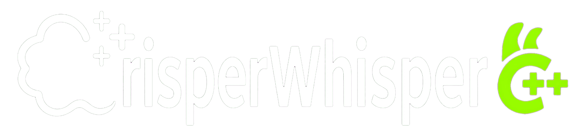

<p align="center">
  
</p>

# CrisperWhisper.cpp

[](https://github.com/Saganaki22/CrisperWhisper.cpp/actions/workflows/native.yml)
[](https://github.com/Saganaki22/CrisperWhisper.cpp/tree/v1.1.0)
[](https://arxiv.org/abs/2607.18934)
[](https://huggingface.co/drbaph/CrisperWhisper2.0-GGML)
[](https://github.com/nyrahealth/CrisperWhisper)
[](LICENSE)
[](https://huggingface.co/nyralabs/CrisperWhisper2.0_large/blob/main/LICENSE.md)

Native C++/CUDA inference for
[Nyra Labs CrisperWhisper 2.0](https://huggingface.co/nyralabs/CrisperWhisper2.0_large):
controllable speech-to-text with verbatim and intended output, word-preserving
long-audio continuation, and no Python dependency at runtime.

The project uses [whisper.cpp](https://github.com/ggml-org/whisper.cpp) and
ggml for optimized CPU/CUDA execution. Python is never needed at runtime and
is only needed when converting an original safetensors checkpoint yourself;
ready-to-run GGML models are available from the link above.

> [!NOTE]
> This is an unofficial community implementation. It is not affiliated with,
> maintained by, or endorsed by Nyra Health or Nyra Labs.

> [!IMPORTANT]
> This repository's C++ code is MIT licensed, but that does **not** change the
> model license. The CrisperWhisper 2.0 weights, checkpoints, parameters,
> configuration files, tokenizers/lexica, and **outputs generated by the
> models** are governed by the
> [Nyra Health Non-Commercial Research License](https://huggingface.co/nyralabs/CrisperWhisper2.0_large/blob/main/LICENSE.md).
> They are limited to non-commercial use unless you obtain a separate
> commercial license from Nyra. Pro models are commercially licensed and
> gated; `large_pro` requires manual access approval.

## At a glance

| Capability | Status |
| --- | --- |
| Windows 10/11 x64 | Supported |
| Linux x86-64 | Supported |
| Linux ARM64 CPU | Experimental portable release; native model smoke-test CI |
| NVIDIA CUDA | RTX 30 / 40 / 50 series |
| CPU-only inference | Portable, balanced AVX2, and native-fast profiles |
| Verbatim transcription | Supported |
| Intended/clean transcription | Supported |
| Audio longer than 30 seconds | Supported |
| WAV, MP3, FLAC, Ogg Vorbis | Automatic decode, mono downmix, and 16 kHz resample |
| Hotword prompts | Supported by compatible Pro checkpoints |
| Verbatimize task | Supported |
| JSON CLI output | Supported |
| Reusable C++ API | Supported |
| Python required during inference | No |
| Supervised word timestamps | Supported; opt-in with `--word-timestamps` |
| Speculative draft-model decoding | Not yet ported |

## Downloads

[GitHub Releases](https://github.com/Saganaki22/CrisperWhisper.cpp/releases/tag/v1.1.0)
contains the native runtime archives; model weights are downloaded separately
from [Hugging Face](https://huggingface.co/drbaph/CrisperWhisper2.0-GGML).

| Package | Intended system |
| --- | --- |
| `crisperwhisper-v1.1.0-windows-x64-cuda-rtx30-40-50.zip` | RTX 3090, 4090, 5090, and compatible NVIDIA GPUs; includes CPU fallback |
| `crisperwhisper-v1.1.0-windows-x64-cpu-portable.zip` | Broad x64 CPU compatibility |
| `crisperwhisper-v1.1.0-windows-x64-cpu-avx2.zip` | Faster general build for AVX2-capable x64 CPUs |
| `crisperwhisper-v1.1.0-linux-x64-cpu-portable.zip` | Broad Linux x64 CPU compatibility |
| `crisperwhisper-v1.1.0-linux-x64-cpu-avx2.zip` | Faster Linux build for AVX2-capable x64 CPUs |
| `crisperwhisper-v1.1.0-linux-arm64-cpu-portable.zip` | Experimental Linux ARM64 CPU build, including Orange Pi |

Linux CUDA remains a source build until a Linux-built package is verified.
No model file is duplicated inside a GitHub archive.

## RTX 5090 benchmark

Measured locally with the large FP16 model and matching verbatim decoding
settings. Lower time and RTF are better.

| Scenario | Native C++/ggml | Python/Transformers | Speedup | Native faster |
| --- | ---: | ---: | ---: | ---: |
| Fresh process + 11s audio | 3.586 s | 14.297 s | 3.99x | 299% |
| Warm 11s audio | 0.462 s | 1.952 s | 4.23x | 323% |
| Warm synthetic 55s audio | 2.065 s | 6.190 s | 3.00x | 200% |

“Native faster” is calculated as `(Python time / native time - 1) × 100`.

The 55-second input repeats the bundled [`samples/jfk.wav`](samples/jfk.wav)
from whisper.cpp; it is a reproducible timing workload, not a natural
long-form quality sample. All rows had exact normalized transcript agreement.
See [BENCHMARKS.md](BENCHMARKS.md) for model-load times, RTF, methodology,
caveats, and raw measurements.

## Quick start

### Windows

```powershell
# One-time model download and conversion.
.\scripts\setup-model.ps1

# Native CUDA build. Use -Cpu for a CPU-only build.
.\scripts\build.ps1

# Transcribe.
.\build\bin\crisper-whisper.exe `
  --model .\models\ggml-crisperwhisper-large-f16.bin `
  --file .\samples\jfk.wav `
  --mode verbatim `
  --language en
```

Windows source-build details are in [CPP.md](CPP.md).

### Linux

```bash
# One-time model download and conversion.
./scripts/setup-model.sh

# Auto-select CUDA when nvcc + an NVIDIA GPU are available.
./scripts/build.sh

# Transcribe.
./build/bin/crisper-whisper \
  --model ./models/ggml-crisperwhisper-large-f16.bin \
  --file ./samples/jfk.wav \
  --mode verbatim \
  --language en
```

Distribution packages, CUDA setup, manual CMake commands, and troubleshooting
are in [BUILD_LINUX.md](BUILD_LINUX.md).

## Common CLI examples

Verbatim output keeps fillers, repetitions, false starts, and vocal events:

```text
crisper-whisper -m MODEL.bin -f meeting.wav --mode verbatim -l en
```

Intended output produces the cleaner version the speaker meant:

```text
crisper-whisper -m MODEL.bin -f meeting.wav --mode intended -l en
```

Machine-readable output:

```text
crisper-whisper -m MODEL.bin -f meeting.mp3 --json
```

Optional supervised word timestamps:

```text
crisper-whisper -m MODEL.bin -f meeting.mp3 --word-timestamps --json
```

The normal path keeps GGML Flash Attention enabled. Word timestamps lazily
load a separate alignment context and run one additional teacher-forced
no-Flash pass because fused Flash Attention does not expose the
decoder-to-audio probability matrix. If the flag is omitted, there is no
alignment pass or timestamp-related model-memory cost.

Add audio-grounded disfluencies to a trusted clean transcript:

```text
crisper-whisper -m MODEL.bin -f meeting.wav \
  --verbatimize "the intended transcript"
```

Show every option:

```text
crisper-whisper --help
```

<details open>
<summary><strong>What CrisperWhisper 2.0 does</strong></summary>

CrisperWhisper makes transcript style an explicit prompt-controlled choice.
The same audio can be decoded as:

- **Verbatim:** what was actually said, including fillers, repetitions,
  stutters, corrections, cut-offs, and vocal events.
- **Intended:** the clean, readable text the speaker meant.

The model is multilingual across most languages supported by Whisper. The
native CLI accepts the usual Whisper language codes such as `en`, `de`, `fr`,
`es`, `ja`, and `zh`.

Nyra's original resources:

- [CrisperWhisper repository](https://github.com/nyrahealth/CrisperWhisper)
- [CrisperWhisper 2.0 large model](https://huggingface.co/nyralabs/CrisperWhisper2.0_large)
- [Research paper](https://arxiv.org/abs/2607.18934)
- [Release post](https://www.nyra-labs.com/crisperwhisper)
- [Verbatim speech benchmark](https://www.nyra-labs.com/research/nyra-verbatim-speech-benchmark)

</details>
<details>
<summary><strong>CLI reference</strong></summary>

### Required arguments

| Option | Meaning |
| --- | --- |
| `-m, --model PATH` | Converted CrisperWhisper ggml model |
| `-f, --file PATH` | WAV, MP3, FLAC, or Ogg; automatically converted in memory to mono 16 kHz |

### Recognition

| Option | Default | Meaning |
| --- | ---: | --- |
| `--mode verbatim\|intended` | `verbatim` | Output style |
| `-l, --language CODE` | `en` | Whisper language code |
| `--hotwords TEXT` | none | Comma-separated hotwords |
| `--verbatimize TEXT` | none | Add audio-grounded disfluencies to trusted text |
| `--max-tokens N` | `256` | Maximum generated tokens per chunk |
| `--word-timestamps` | off | Add supervised cross-attention word timings |
| `-t, --threads N` | hardware count | CPU worker threads |

### Long audio

| Option | Default | Meaning |
| --- | ---: | --- |
| `--chunk-seconds N` | `30` | Encoder window, maximum 30 seconds |
| `--stride-seconds N` | `26` | Window advance |
| `--context-words N` | `12` | Confirmed words supplied to the next window |
| `--drop-words N` | `2` | Boundary words left for overlap re-coverage |

### Hardware and output

| Option | Meaning |
| --- | --- |
| `--cpu` | Disable GPU offload |
| `--gpu N` | Select CUDA device index |
| `--no-flash-attn` | Disable flash attention |
| `--json` | Emit text, mode, language, chunk metadata, and requested word timings as JSON |
| `-h, --help` | Print built-in help |

Example with long-audio tuning:

```text
crisper-whisper \
  -m models/ggml-crisperwhisper-large-f16.bin \
  -f interview.flac \
  --mode verbatim \
  --language en \
  --chunk-seconds 30 \
  --stride-seconds 26 \
  --context-words 12 \
  --drop-words 2 \
  --json
```

</details>

<details>
<summary><strong>Model download and conversion</strong></summary>

### Available CrisperWhisper 2.0 checkpoints

| Model | Hugging Face | Access and notes |
| --- | --- | --- |
| Small | [`nyralabs/CrisperWhisper2.0_small`](https://huggingface.co/nyralabs/CrisperWhisper2.0_small) | Public; smallest standard checkpoint |
| Medium | [`nyralabs/CrisperWhisper2.0_medium`](https://huggingface.co/nyralabs/CrisperWhisper2.0_medium) | Public; size/quality trade-off |
| Turbo | [`nyralabs/CrisperWhisper2.0_turbo`](https://huggingface.co/nyralabs/CrisperWhisper2.0_turbo) | Public; fastest standard checkpoint |
| Large | [`nyralabs/CrisperWhisper2.0_large`](https://huggingface.co/nyralabs/CrisperWhisper2.0_large) | Public; default and tested by this port |
| Large Pro | [`nyralabs/CrisperWhisper2.0_large_pro`](https://huggingface.co/nyralabs/CrisperWhisper2.0_large_pro) | Manually gated; approval and commercial model license required |

Ready-to-run F16 GGML conversions of the four public checkpoints are hosted
together at
[`drbaph/CrisperWhisper2.0-GGML`](https://huggingface.co/drbaph/CrisperWhisper2.0-GGML).
Download the `.bin` you want into `models/`; you do not need Python or the
conversion step when using one of these files.

| Converted model | Download |
| --- | --- |
| Small | [`ggml-crisperwhisper-small-f16.bin`](https://huggingface.co/drbaph/CrisperWhisper2.0-GGML/resolve/main/ggml-crisperwhisper-small-f16.bin?download=true) |
| Medium | [`ggml-crisperwhisper-medium-f16.bin`](https://huggingface.co/drbaph/CrisperWhisper2.0-GGML/resolve/main/ggml-crisperwhisper-medium-f16.bin?download=true) |
| Turbo | [`ggml-crisperwhisper-turbo-f16.bin`](https://huggingface.co/drbaph/CrisperWhisper2.0-GGML/resolve/main/ggml-crisperwhisper-turbo-f16.bin?download=true) |
| Large | [`ggml-crisperwhisper-large-f16.bin`](https://huggingface.co/drbaph/CrisperWhisper2.0-GGML/resolve/main/ggml-crisperwhisper-large-f16.bin?download=true) |

The standard small, medium, turbo, and large models remain subject to Nyra's
[Non-Commercial Research License](https://huggingface.co/nyralabs/CrisperWhisper2.0_large/blob/main/LICENSE.md).
Model files are downloaded from Hugging Face during setup and are never
included in this GitHub repository.

The default setup scripts download
`nyralabs/CrisperWhisper2.0_large` and produce:

```text
models/
  ggml-crisperwhisper-large-f16.bin
```

The Hugging Face download is approximately 3.1 GB. The converted F16 model is
approximately 2.9 GB.

Windows:

```powershell
.\scripts\setup-model.ps1
```

Linux:

```bash
./scripts/setup-model.sh
```

Choose another open checkpoint:

```powershell
.\scripts\setup-model.ps1 `
  -Model "nyralabs/CrisperWhisper2.0_medium" `
  -Output "models/ggml-crisperwhisper-medium-f16.bin"
```

```bash
./scripts/setup-model.sh \
  --model nyralabs/CrisperWhisper2.0_medium \
  --output models/ggml-crisperwhisper-medium-f16.bin
```

The converter streams safetensors directly and requires only NumPy and
`huggingface_hub`; it does not install PyTorch or Transformers.

</details>

<details>
<summary><strong>Why is the converted model a <code>.bin</code> file?</strong></summary>

`ggml` is the tensor format and runtime family, not a required filename
extension. Traditional whisper.cpp models use names such as
`ggml-model-f16.bin`: the `ggml-` prefix describes the serialization and
`.bin` identifies the binary container.

This project writes whisper.cpp's supported legacy GGML model container rather
than GGUF because that loader accepts the exact Whisper tensor layout and full
51,896-token CrisperWhisper vocabulary we need. The file begins with GGML's
format magic and structured hyperparameters, vocabulary, and named tensors; it
is not an unstructured weight dump.

GGUF could be added later if whisper.cpp's Whisper loader and conversion path
make it useful, but changing the extension alone would not convert the format
or improve inference.

</details>

<details>
<summary><strong>Windows build</strong></summary>

Known-good requirements:

| Dependency | Notes |
| --- | --- |
| Visual Studio Build Tools | 2022, Desktop development with C++ |
| CMake | 3.20 or newer |
| Python | 3.10+; 3.12 recommended for conversion |
| NVIDIA driver | Required for CUDA inference |
| CUDA Toolkit | 12.8+ to build the default RTX 30/40/50 universal target |

CUDA:

```powershell
.\scripts\build.ps1
```

CPU:

```powershell
.\scripts\build.ps1 -Cpu
```

Backend and CPU tuning are independent. CUDA builds retain a CPU fallback
using the selected CPU profile.

| Profile | Build setting | Best for | Trade-off |
| --- | --- | --- | --- |
| `balance` | AVX2, native tuning off | Most modern x86-64 PCs | Recommended default |
| `portable` | Baseline CPU target, optional x86 SIMD off | Older or unknown CPUs | Broadest compatibility, slowest |
| `fast` | Native tuning for the build machine | Your own newer CPU | Fastest CPU path, least portable |

```powershell
# Self-contained CPU builds.
.\scripts\build.ps1 -Cpu -CpuProfile portable -BuildDirectory build-cpu-portable
.\scripts\build.ps1 -Cpu -CpuProfile balance  -BuildDirectory build-cpu-balance
.\scripts\build.ps1 -Cpu -CpuProfile fast     -BuildDirectory build-cpu-fast

# CUDA plus a balanced AVX2 CPU fallback.
.\scripts\build.ps1 -CpuProfile balance -BuildDirectory build-cuda
```

The wrapper loads the Visual Studio 2022 x64 compiler environment and uses
Visual Studio's bundled Ninja. This allows CMake to drive `nvcc` without
requiring CUDA's optional Visual Studio extension.

The default release target is `86;89;120`, producing one binary for RTX 3090,
RTX 4090, and RTX 5090-class GPUs. Use `-CudaArchitectures` to make a narrower
custom build. [CUDA 12.8](https://docs.nvidia.com/cuda/archive/12.8.0/cuda-toolkit-release-notes/index.html)
was the first toolkit with `sm_120` compiler support; with an older toolkit,
target only the architecture it supports.

```powershell
# Examples for a smaller GPU-specific build.
.\scripts\build.ps1 -CudaArchitectures "86"  # RTX 3090
.\scripts\build.ps1 -CudaArchitectures "89"  # RTX 4090
.\scripts\build.ps1 -CudaArchitectures "120" # RTX 5090 (CUDA 12.8+)
```

</details>

<details>
<summary><strong>Linux build</strong></summary>

CPU or automatic CUDA detection:

```bash
./scripts/build.sh
```

Force a backend:

```bash
./scripts/build.sh --cuda
./scripts/build.sh --cpu
```

Choose the CPU compatibility profile for either backend:

```bash
./scripts/build.sh --cpu  --cpu-profile portable --build-dir build-cpu-portable
./scripts/build.sh --cpu  --cpu-profile balance  --build-dir build-cpu-balance
./scripts/build.sh --cpu  --cpu-profile fast     --build-dir build-cpu-fast
./scripts/build.sh --cuda --cpu-profile balance  --build-dir build-cuda
```

Install the resulting CLI into the configured CMake prefix:

```bash
cmake --install build --config Release
```

See [BUILD_LINUX.md](BUILD_LINUX.md) for Ubuntu/Debian, Fedora, Arch,
CUDA-toolkit, compiler-compatibility, and troubleshooting instructions.

</details>

<details>
<summary><strong>Long-audio continuation</strong></summary>

Whisper-family encoders process at most 30 seconds at once. CrisperWhisper was
trained with a conditional-continuation prompt:

```text
[mode tags] <ctx> confirmed words from the previous window <ectx>
```

The native runtime follows that design:

1. Decode a 30-second window.
2. Confirm its safe words, leaving a small boundary tail to be re-covered.
3. Advance 26 seconds, creating a 4-second overlap.
4. Put the last 12 confirmed words in the next decoder prompt.
5. Continue until the end of the recording.

This does not naively concatenate overlapping model output:

- With `--word-timestamps`, the 26-second stride is an ownership cutoff.
  Words beginning in a chunk's trailing overlap are emitted by the next
  window, not both windows.
- Exact normalized suffix/prefix matches are removed at each seam.
- A word straddling the cutoff is deduplicated by text and time.
- Emitted word times are clamped and monotonized, so `start <= end` and a
  later word never begins before the previous emitted word ends.
- Without word timestamps, the fixed boundary tail remains as a fallback and
  the same text seam matcher removes exact repeated sequences.

The bundled 55-second repeated-JFK regression completed with zero invalid
timestamps, zero overlapping adjacent word pairs, and zero adjacent
text/timestamp duplicates.

</details>

<details>
<summary><strong>Why stock whisper.cpp conversion is not enough</strong></summary>

CrisperWhisper 2.0 uses the Whisper encoder/decoder architecture, but appends
32 vocabulary entries after Whisper's timestamp tokens:

- 15 vocal-event tokens
- 5 verbatim-strength tokens
- 5 intended-strength tokens
- verbatimize start/end markers
- continuation-context start/end markers
- hotword start/end markers

Stock whisper.cpp currently infers several control-token positions from total
vocabulary size. With these appended tokens, its high-level decoder would
select incorrect task/timestamp IDs.

This project fixes the compatibility boundary without maintaining a fork of
ggml:

1. The converter serializes the complete Hugging Face vocabulary.
2. The C++ runtime discovers control IDs from their actual token strings.
3. It uses whisper.cpp's low-level encoder/decoder API.
4. Mode material is placed before the standard Whisper decoder prefix, matching
   CrisperWhisper training.

</details>

<details>
<summary><strong>C++ API</strong></summary>

```cpp
#include <crisperwhisper.h>
#include <iostream>

int main() {
    crisperwhisper::Model model(
        "models/ggml-crisperwhisper-large-f16.bin"
    );

    crisperwhisper::TranscriptionOptions options;
    options.mode = crisperwhisper::Mode::Verbatim;
    options.language = "en";

    const auto result = model.transcribe_file("meeting.wav", options);
    std::cout << result.text << '\n';
}
```

The public API is declared in
[`include/crisperwhisper.h`](include/crisperwhisper.h). It accepts either an
audio file or caller-provided mono 16 kHz float PCM.

</details>

<details>
<summary><strong>Architecture and project layout</strong></summary>

```text
Audio file
  -> native decode/resample to mono 16 kHz
    -> Whisper log-mel frontend
      -> ggml encoder on CPU/CUDA
        -> CrisperWhisper custom decoder prompt
          -> native greedy autoregressive decode
            -> continuation stitching
              -> text or JSON
```

```text
include/crisperwhisper.h        Public C++ API
src/crisperwhisper.cpp          Prompting, inference, long audio
src/audio.cpp                   Native audio decode/resample
src/word_timing.cpp             Supervised cross-attention word alignment
src/main.cpp                    CLI
tools/convert_hf_to_ggml.py     One-time safetensors converter
scripts/build.ps1               Windows build wrapper
scripts/build.sh                Linux build wrapper
scripts/package-windows.ps1     Self-contained Windows release ZIPs
scripts/setup-model.ps1         Windows model setup
scripts/setup-model.sh          Linux model setup
tests/cpp/                      Native tests
.github/workflows/native.yml    Windows/Linux CPU build matrix
.github/workflows/release.yml   Tagged Windows/Linux CPU ZIP releases
```

whisper.cpp is fetched at configure time and pinned to a known commit for
reproducible model-format compatibility.

</details>

<details>
<summary><strong>Current parity and roadmap</strong></summary>

Implemented natively:

- Standard CrisperWhisper 2.0 inference
- Verbatim and intended prompt control
- Verbatimize prompt construction
- Hotword prompt construction
- Long-audio continuation
- Default token suppression
- F16 ggml conversion
- CUDA and CPU backends
- Native audio decode/resample
- JSON results and per-chunk metadata
- Opt-in supervised cross-attention word timestamps
- Timestamp-aware overlap ownership and seam deduplication

Still to port from Nyra's Python package:

- Forced alignment
- Dual verbatim/intended batching
- Speculative decoding with a smaller draft checkpoint
- Full looping-hallucination repair
- Coverage-gated temperature fallback
- Early-EOT recovery

The README does not claim feature parity for items in the second list.

</details>

<details>
<summary><strong>Verification</strong></summary>

Native unit tests:

```powershell
ctest --test-dir build -C Release --output-on-failure
```

```bash
ctest --test-dir build --output-on-failure
```

The repository includes a six-job x86-64 CPU matrix covering portable,
balanced, and fast profiles on both `windows-latest` and `ubuntu-latest`, plus
a native `ubuntu-24.04-arm` portable ARM64 job. ARM64 release builds also
download the Small GGML model and run a timestamped JFK transcription before
packaging. Linux ARM64 remains experimental pending broader device testing,
including Orange Pi. Windows ARM64 and ARM CUDA/Jetson are not supported in
v1.1.0. CUDA execution should also be tested on the intended GPU architecture
because standard hosted CI runners do not provide NVIDIA GPUs.

A functional model test should verify:

- Model vocabulary size is `51896`.
- All custom mode/context/hotword markers load.
- Verbatim and intended prompts produce distinct output on the same audio.
- Short audio completes without timestamp/control tokens in output.
- Long audio returns ordered chunk metadata with continuation context.
- `--json` output parses as valid JSON.

</details>

<details>
<summary><strong>Troubleshooting</strong></summary>

### `model vocabulary is missing required CrisperWhisper token`

The model was probably converted with the stock whisper.cpp converter.
Reconvert it with:

```text
tools/convert_hf_to_ggml.py
```

### Windows says `No CUDA toolset found`

Use `scripts/build.ps1`, which configures the supported Visual Studio compiler
environment and Ninja automatically. Confirm `nvcc --version` works.

### `nvidia-smi is not on PATH`

Update/install the NVIDIA driver, or build CPU-only:

```powershell
.\scripts\build.ps1 -Cpu
```

### Linux cannot find `nvcc`

Install the CUDA toolkit or build CPU-only:

```bash
./scripts/build.sh --cpu
```

### The first model setup is slow

The default checkpoint download is multi-gigabyte. Conversion then reads BF16
safetensors and writes a new F16 ggml model. Later launches use that converted
file directly.

### Commercial deployment

The MIT code license does not override the checkpoint license. Contact Nyra
for commercial model licensing.

</details>

## Licensing and credits

- Native port and repository inference code: [MIT](LICENSE)
- whisper.cpp and ggml: MIT
- Miniaudio and stb_vorbis: included through whisper.cpp under their upstream
  licenses
- CrisperWhisper 2.0 standard models and their outputs:
  [Nyra Health Non-Commercial Research License](https://huggingface.co/nyralabs/CrisperWhisper2.0_large/blob/main/LICENSE.md)
- CrisperWhisper 2.0 Pro models: gated, commercial license required

Credits:

- [Nyra Health / Nyra Labs](https://github.com/nyrahealth) for
  CrisperWhisper and the open checkpoints
- [ggml-org](https://github.com/ggml-org/whisper.cpp) for whisper.cpp/ggml
- [0xShug0/audio.cpp](https://github.com/0xShug0/audio.cpp) as a reference for
  structuring native multi-platform audio inference projects
